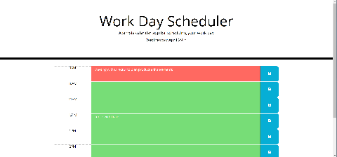
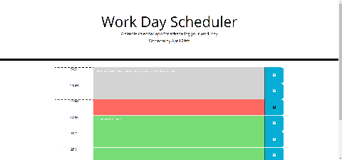

# DailyPlanner
Daily planner that dynamically updates according to current time
Purpose is to provide a simple way to keep track of tasks during the current work day

## Requirements
 1. Current day is displayed at the top of calendar
 2. Should include standard working hours (9am-5pm)
 3. Current time block must be visually distinct
 4. Past time blocks must be visually distinct
 5. Future time blocks must be visually distinct
 6. Text in time block is stored in local storage and should persist if page is reloaded

## Images of Daily Planner  

